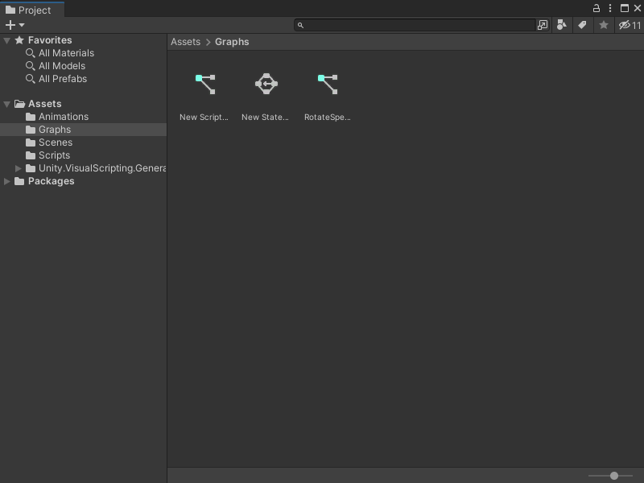

# Open a graph file for editing 

You can open a graph file from multiple locations, depending on the graph type and its source type. 

## Project window 

To open a graph for editing from the Project window: 

1. (Optional) If your Project window isn't already open, go to **Window** &gt; **General** &gt; **Project**, or press CTRL + 5 (macOS: Cmd + 5). 

2. Find the location in your Project window's folders where you saved the graph file you want to edit.

    

3. Double-click the graph file to open it in the Graph window. 

## From the Graph Inspector 

If you have a nested or embedded graph inside another graph file, you can open it for editing from the Graph Inspector.

1. In the Graph window, select the node that represents the graph you want to edit. This node could be a transition, Super State, Subgraph, or State Unit. 

2. In the Graph Inspector, select **Edit Graph**. 
    The graph opens in the same Graph window for editing. 

> [!TIP]
> If the Graph Inspector isn't visible in the Graph window, select **Graph Inspector** () from the toolbar.

## From a Script Machine or State Machine 

If you've attached or embedded a graph in a Script Machine or State Machine on a GameObject, you can open the graph for editing from the Inspector window: 

1. In the Editor's Hierarchy window, select the GameObject that has the Script Machine or State Machine with the graph you want to edit. 
    If the Hierarchy window isn't visible, go to **Window** &gt; **General** &gt; **Hierarchy** or press CTRL + 4 (macOS: Cmd + 4).

2. On the Script Machine or State Machine component, select **Edit Graph**. 

## Next steps 

After you open your graph file, you can add a node to your graph. For more information on how to add a node to a Script Graph, see [Add a node to a Script Graph](vs-add-node-to-graph.md). 

For more information on how to edit a State Graph, see [Developing logic transitions using State Graphs](vs-state-graphs-intro.md).