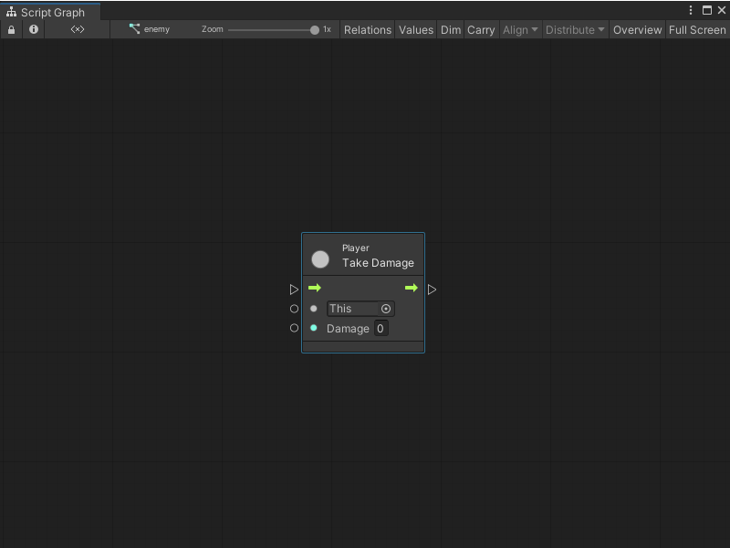
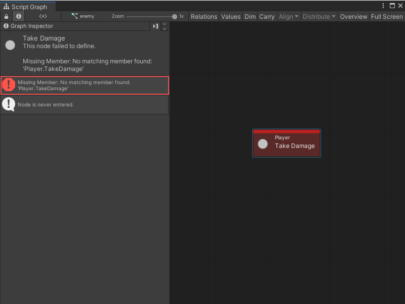

# Refactoring the script

> [!NOTE]
> For versions 2019/2020 LTS, download the Visual Scripting package from the [Unity Asset Store](https://assetstore.unity.com/packages/tools/visual-bolt-163802).

Visual scripting automatically calls methods, fields and properties from any custom script in the project. For example, you can create a node from a custom Player class with a TakeDamage method.

```
    using UnityEngine;

    public class Player : MonoBehaviour
    {
        public void TakeDamage(int damage)
        {
            // ...
        }
    }
```



In the script graph, if you change your script and rename or remove the TakeDamage method or the Player class, such as in the example below:

```
    using UnityEngine;

    public class Player : MonoBehaviour
    {
        public void InflictDamage(int damage)
        {
            // ...
        }
    }
```

The node turns red in the graph window and a warning appears in the Graph Inspector:  




## Renaming Members

To continue the previous example, to fix the failure, reopen the script file and map the new name to the previous name with the `[RenamedFrom]` attribute. It takes a single string parameter,... that is the previous name of the member.

```
    using UnityEngine;
    using Unity.VisualScripting;

    public class Player : MonoBehaviour
    {
        [RenamedFrom("TakeDamage")]
        public void InflictDamage(int damage)
        {
            // ...
        }
    }
```

It is recommended to leave the attribute in your source even after a successful recompile. Visual scripting cannot guarantee Unity reserializes all the graphs with the corrected name. Visual scripting's `[RenamedFrom]` attribute works much like Unity's own [`[FormerlySerializedAs]`](https://docs.unity3d.com/ScriptReference/Serialization.FormerlySerializedAsAttribute.html) attribute in that regard.

## Renaming Types

You can rename types (including classes, structs and enums) using the `[RenamedFrom]` attribute.

For example, `Player` class is renamed to `Character`:

```
    using UnityEngine;
    using Unity.VisualScripting;

    [RenamedFrom("Player")]
    public class Character : MonoBehaviour
    {
        [RenamedFrom("TakeDamage")]
        public void InflictDamage(int damage)
        {
            // ...
        }
    }
```
> [!NOTE]
> The old name must include the namespace. In the previous example, this wasn't required as the name was in the global namespace.
